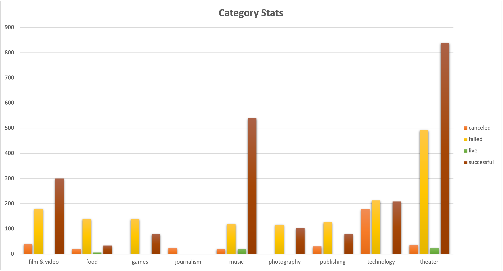
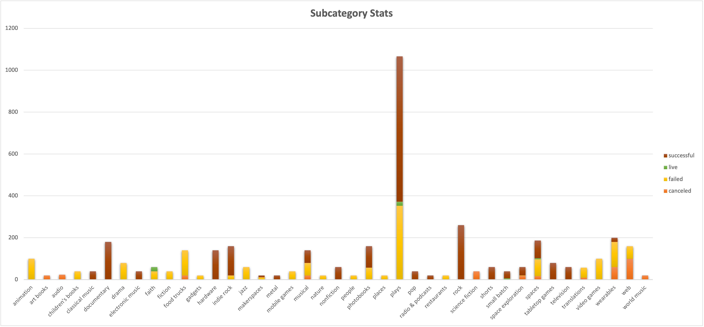
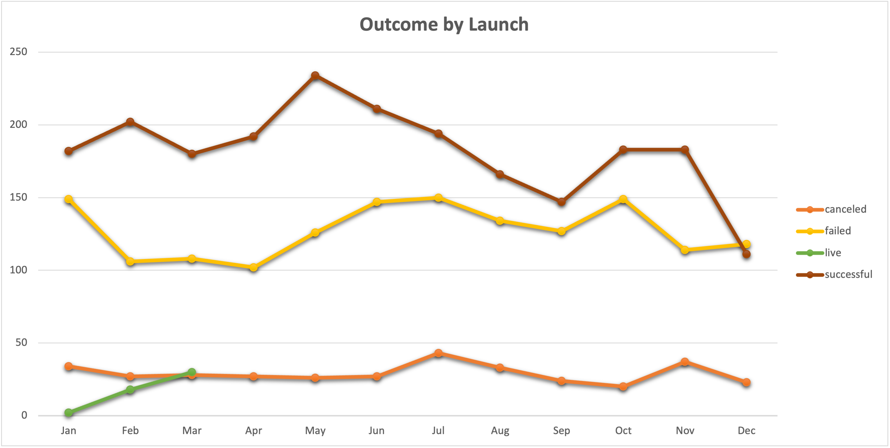
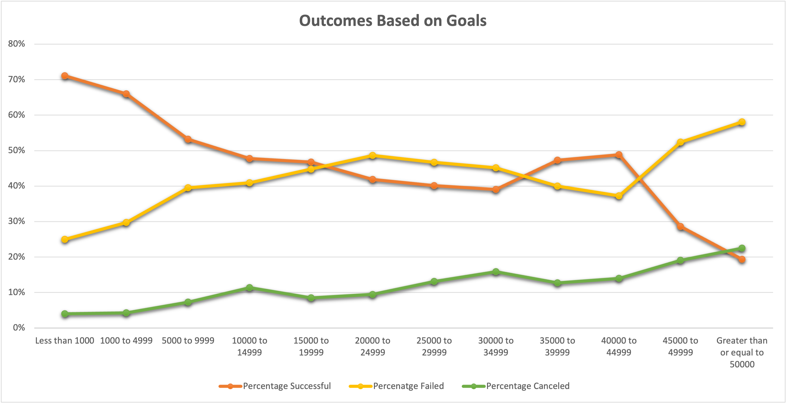
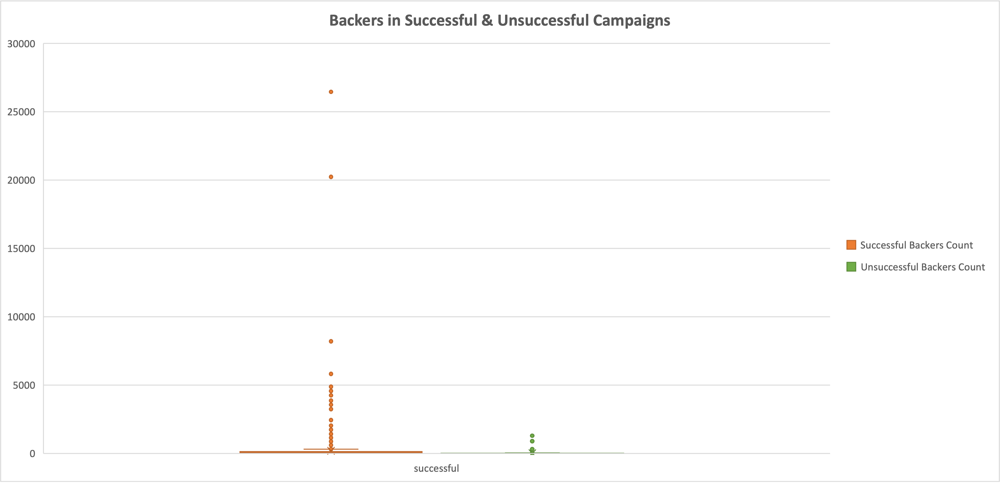

# Observations

## Statistics by Category

The Theater category had the highest count of successful backers, while the Food Category had the lowest. 

This means Theater's subcategories are **most likely** to outperform the others.

There is no available data for the Journalism category due to a full cancellation.

## Statistics by Subcategory

As predicted, Theater's Plays subcategory had the highest count of successful backers.

## Outcomes Based on Launch Date

June had the highest reported backer outcomes.

By end of year, all three backer outcome reports dropped significantly.

The Canceled backer outcomes remained stagnant until July. 

## Outcomes Based on Goals

The success rate of the campaign backers varies by goal.

### Successful Backers

The highest outcome was for **Less Than 1,000** backers at 71%.

As the goal numbers increased, the outcome decreased.

### Unsuccessful Backers

The highest outcome was for **Greater Than 50,000** backers at 58%.

There were less failed backers within the **Less Than 1,000** threshold. 

## Final Stats

There are outliers in successful campaigns whose number of backers significanly skew the mean to the right. The median therefore summarizes the data more meaningfully.

